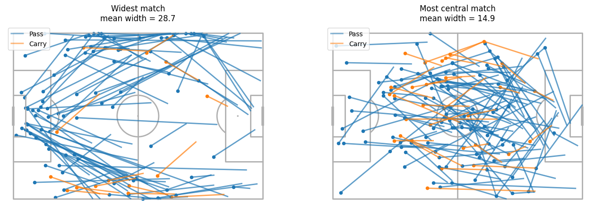
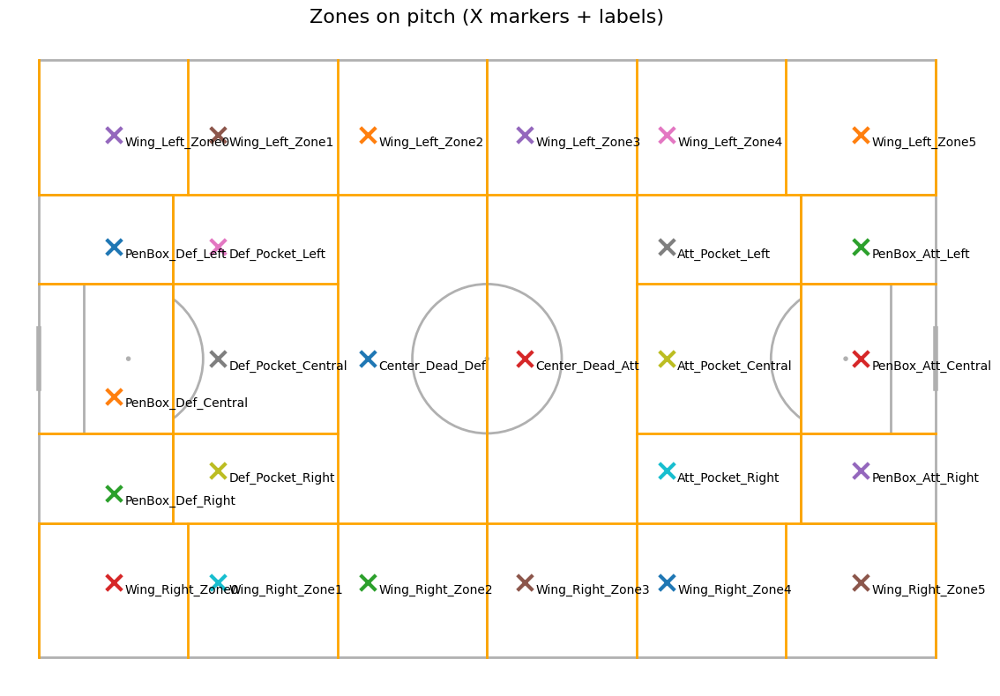

# Exjobb – Generative Modelling of Football Tactics from Event Data

This repository contains the ongoing work for a Master’s thesis (Exjobb) focused on **learning and generating tactical football behaviour** from event-based match data, with selective grounding in spatial player context.

The project investigates how **team-level tactical characteristics** (e.g. width, directness, pressing behaviour) can be represented as **low-dimensional, interpretable control variables** and used to condition generative models of football match events.

---

## Project Motivation

Most football analytics models are designed for **prediction** (e.g. outcomes, xG, player actions). This project instead focuses on **representation and generation**:

- How can tactical behaviour be **abstracted** from raw event data?
- Which tactical dimensions are **stable, interpretable, and controllable**?
- Can generative models reproduce realistic sequences of football actions when conditioned on tactical inputs?

The emphasis is therefore on **team-level structure**, not player evaluation or single-event prediction.

---

## Data Sources

The project primarily uses data from **StatsBomb Open Data**:

- **Event data**  
  Passes, carries, shots, defensive actions, set pieces, etc.  
  (~3000+ matches)

- **StatsBomb 360 data (limited subset)**  
  Freeze-frame player positions at event timestamps  
  (~330 matches)

Event-only matches are used to learn broad tactical patterns, while 360 data is used to:
- ground spatial concepts,
- validate abstractions,
- and later inform latent spatial representations.

---

## Tactical Feature Philosophy

This project does **not** attempt to infer tactics implicitly from raw sequences alone.  
Instead, tactics are represented explicitly as **conditioning variables**.

Key design principles:
- Team-level (not player-level)
- Low-dimensional
- Interpretable
- Stable across matches
- Suitable for generative conditioning

### Core Tactical Dimensions (current focus)

- **Offensive width**  
  Distribution of progressive passes and carries across pitch width ✅ Done

- **Directness**  
  Degree of forward-oriented ball progression

- **Pass length**

- **Tempo**  
  Frequency of ball actions during possession phases

- **Pressing intensity & triggers**  
  Defensive actions in the opponent’s half and time to ball regain

- **Backline height** *(derived / latent from 360 data)*

- **Rest defence structure** *(proxy or latent)*

- **Progressive passes**

- **Final third entries**

- **Ball speed**

- **Set pieces** *(categorical context)*

---

## Pitch Zoning

A **custom pitch zoning system** is used instead of most common positionism zones.

Zones are designed to capture:
- width vs central occupation,
- progression channels,
- defensive vs attacking context,
- and tactically meaningful “dead” central areas.

Zones are semantic and tactical — not purely geometric — and are used consistently across feature extraction. The zones have been constructed with feedback from experts in the field - former footballplayers and current analysts.

Here is how the field is split up:

---

## Modelling Approach (High-Level)

The intended modelling pipeline is:

1. **Extract tactical features** from event data
2. **Represent tactics** as structured conditioning variables
3. **Train generative models** (e.g. conditional VAEs) on event sequences
4. **Incorporate spatial grounding** from 360 data via latent representations
5. **Generate realistic event sequences** consistent with tactical inputs

The repository currently focuses on **data handling, feature extraction, zoning logic, and tactical representation**.

---

## Repository Structure (high-level)

Exjobb/
├── data/ # Data paths & handling (local, not tracked)
├── notebooks/ # Exploratory analysis and feature prototyping
├── src/ # Core code (feature extraction, zoning, utils)
├── scripts/ # Data processing / analysis scripts
└── README.md

(Structure may evolve as modelling components are added.)

---

## Scope & Current Status

**Implemented / in progress**
- Event data ingestion
- Custom pitch zoning
- Tactical feature definitions (width, progression, pressure, entries)
- Team-level aggregation logic
- Exploratory spatial analysis with 360 data

**Planned**
- Formal generative modelling
- Latent spatial representations from 360 data
- Controlled sequence generation
- Evaluation of tactical fidelity

---

## Academic Context

This work is conducted as part of a Master’s thesis in engineering / machine learning.  
The project prioritises:
- methodological clarity,
- defensible abstractions,
- and reproducible analysis.

The repository is under active development.

---

## Notes

- Large datasets are **not included** in the repository.
- Paths assume local availability of StatsBomb Open Data.
- Code and structure may change as the thesis progresses.

---

## Author

Stefan Ivchenko  
stefanfredrikivchenko@gmail.com
Master’s Thesis Project
